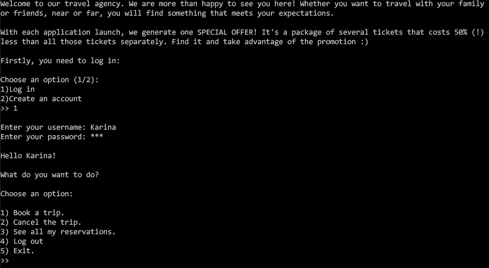
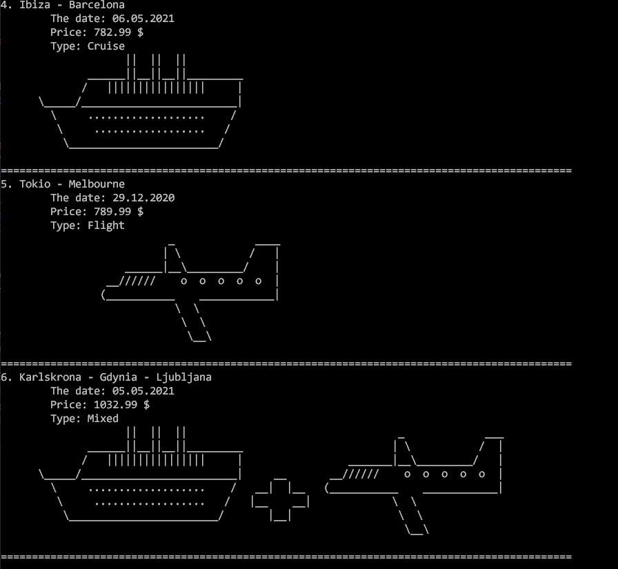
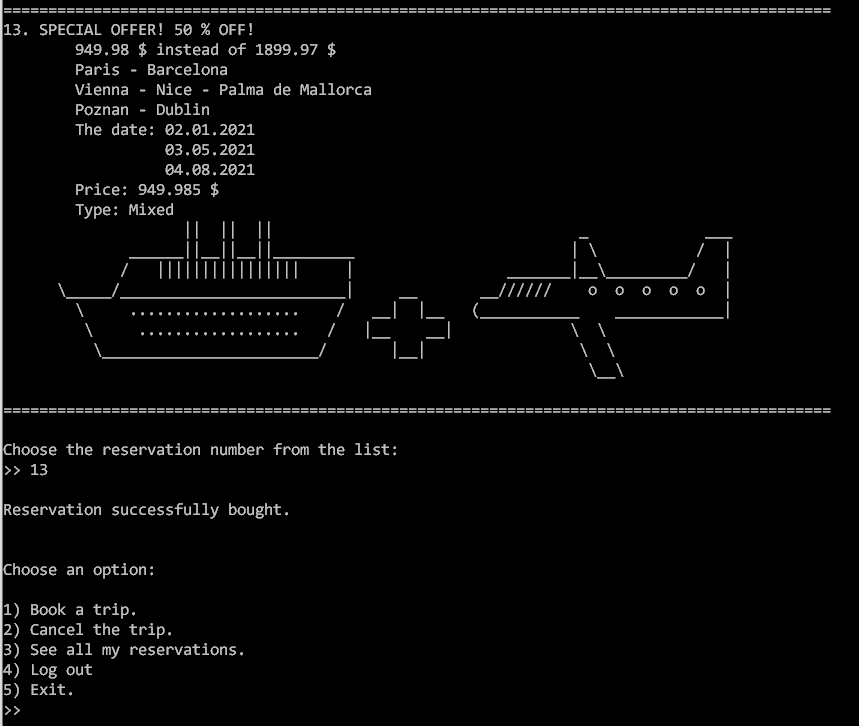

# Trip Planner C++

Welcome to our travel agency. We are more than happy to see you here! Whether you want to travel with your family or friends, near or far, you will find something that meets your expectations. We offer a variety of plane tickets, cruises and also some mixed trips all around the world!

Moreover, with each application launch, we generate one SPECIAL OFFER! It's a package of several tickets that costs 50% (!) less than all those tickets separately. Find it and take advantage of the promotion :)

## Usage

-   Firstly you need to log in or create an account. But don't worry, it's really easy, the instructions on the screen will guide you all the time :)

      

-   Then you can choose what you want to do:
   1) See all of the available offers and book a ticket.
   2) Cancel a trip.
   3) Review the tickets you've already bought.
   4) Log out.
   5) Exit the program.
  
- Offer examples:

    

- Special Offer example:

    

## Built With

-   C++

## Authors

**Karina Szubert** (https://github.com/Karina-00)

## License

[Mozilla Public License 2.0](https://choosealicense.com/licenses/mpl-2.0/)
